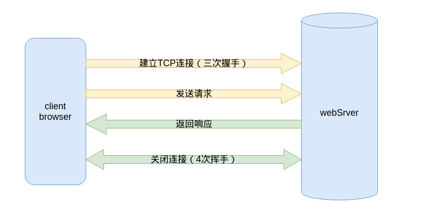
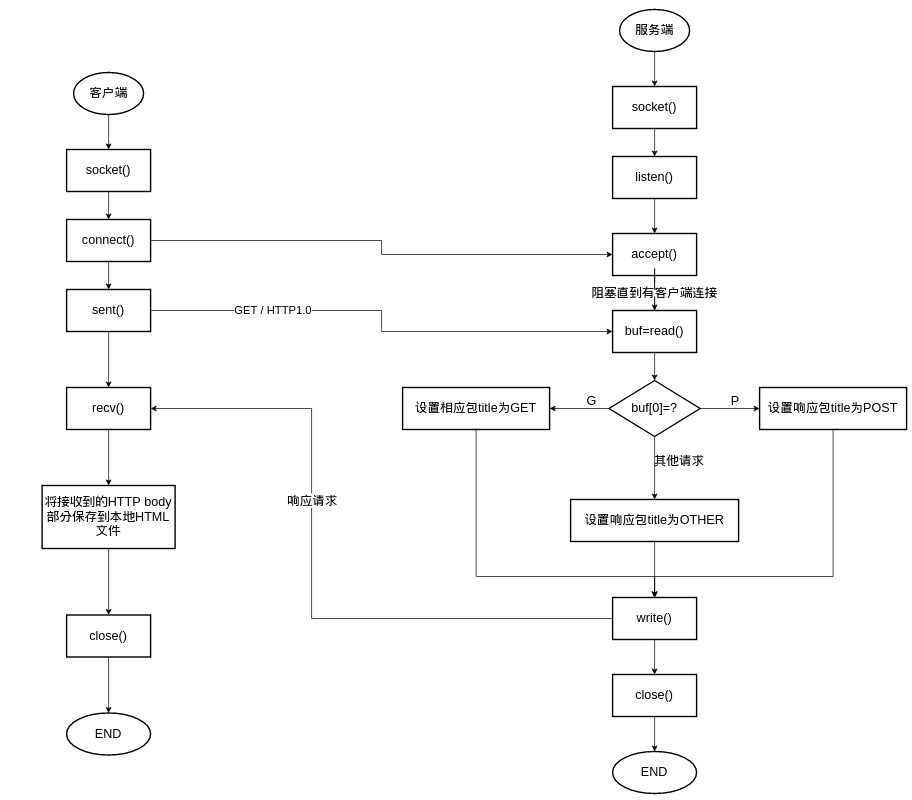

# 简单 WEBserver实现  
本文实现一个简单的无状态的HTTP协议。原理是任意的web客户端向服务端发起一个GET请求或者POST请求，然后web服务器分析头几个字节来确定客户端发起的请求方式，然后服务器回应对应请求的响应。

### 0x01 http协议简介
引用百度百科对于http协议的定义
> 超文本传输协议（Hyper Text Transfer Protocol，HTTP）是一个简单的请求-响应协议，它通常运行在TCP之上。它指定了客户端可能发送给服务器什么样的消息以及得到什么样的响应。请求和响应消息的头以ASCII形式给出；而消息内容则具有一个类似MIME的格式。这个简单模型是早期Web成功的有功之臣，因为它使开发和部署非常地直截了当。

简单来说HTTP协议是一个应用层协议，且它是面向连接的，即基于TCP协议来传输超文本。一个典型的工作过程如下图  

其中发送请求的HTTP报文为请求报文，服务端返回响应的报文叫响应报文。而HTTP报文大概可分为报文头部和数据部分两块，HTTP报文本身是由多行（CRLF换行）数据构成的字符串文本,HTTP的首部和数据部分用CRLF来划分。通常不一定会有数据部分。  
  
所以在程序中要获取http的数据部分，只需要找到存在2个CRLF的位置，即`\r\n\r\n`，它的后面就是数据部分。

#### 1.1 关于HTTP请求的方法
这里介绍一下以下程序使用的HTTP方法，如下表  
| 方法    | 说明           |
|---------|----------------|
| GET     | 获取资源       |
| POST    | 传输数据部分   |
| PUT     | 传输文件       |
| HEAD    | 获得报文首部   |
| OPTIONS | 询问支持的方法 |

0x03中的服务端程序只识别`GET`和`POST`方式的请求，而这两种方式也是HTTP协议中最常用的方法，其他方式的请求都默认回应一个包，而且不支持CGI解析。当然一个正常的WEB服务器功能是支持CGI解析和大多数HTTP方法的，不过为了安全起见，一般网站管理员都会把`GET`和`POST`之外的方法都关闭掉。

### 0x02 服务端与客户端流程图


### 0x03 服务端实现
以下是服务端的代码实现
```c
#include <sys/socket.h>
#include <sys/un.h>
#include <arpa/inet.h>
#include <unistd.h>
#include <string.h>
#include <stdio.h>

#define PORT 8080                       // 服务器监听端口

int send_respond(int client_socket, char res[]);

int main(){
    
    int server_socket = socket(AF_INET, SOCK_STREAM, 0);
    
    struct sockaddr_in server_addr;
    memset(&server_addr, 0, sizeof(server_addr));
    server_addr.sin_family = AF_INET;
    server_addr.sin_addr.s_addr = htonl(INADDR_ANY);
    server_addr.sin_port = htons(PORT);

	// set port rebind
	int opt = 1;
	setsockopt(server_socket, SOL_SOCKET, SO_REUSEADDR, (const void *)&opt, sizeof(opt));
    
    bind(server_socket, (struct sockaddr *)&server_addr, sizeof(server_addr));
    
    listen(server_socket, 5);
    
    int client_socket = accept(server_socket, NULL, NULL);
    
    char buf[4096];
    read(client_socket, buf, 4096);
    
    printf("%s",buf);

	if(buf[0] == 'G'){
		char *temp = "GET";
		send_respond(client_socket, temp);
	}
	else if(buf[0] == 'P'){
		char *temp = "POST";
		send_respond(client_socket, temp);
	}
	else{
		char *temp = "OTHER";
		send_respond(client_socket, temp);
	}

    close(client_socket);
    close(server_socket);

    return 0;
}

int send_respond(int client_socket, char res[]){
	if(client_socket < 0) return -1;
	char status[] = "HTTP/1.0 200 OK\r\n";
	char header[] = "Server: DWBServer\r\nContent-Type: text/html;charset=utf-8\r\n\r\n";
	char temp[] = "<html><head><title>%s</title></head><body><h2>欢迎</h2><p>Hello，World</p></body></html>";
	char body[4096] = "";
	sprintf(body, temp, res);
	write(client_socket, status, sizeof(status));
	write(client_socket, header, sizeof(header));
	write(client_socket, body, sizeof(body));

	return 0;
}
```

该服务器端代码比较简单，只是简单的判断了客户端的HTTP请求方法，然后根据其方法返回不同的HTTP响应。

### 0x04 客户端实现
以下是客户端的代码实现
```c
#include<stdio.h>
#include<stdlib.h>
#include<string.h>    //strlen
#include<sys/socket.h>
#include<arpa/inet.h> //inet_addr
#include<netdb.h>
#include<errno.h>

#define SERV_PORT 8080


int main(int argc, char *argv[])
{
    int socket_desc;
    struct sockaddr_in server;
    char *message;
	FILE *fp = NULL;
	// open browser to save the html
	if( (fp=fopen("index.html","wt")) == NULL ){
        perror("Fail to open file!");
    }

    //Create socket
    socket_desc = socket(AF_INET, SOCK_STREAM , 0);
    if (socket_desc == -1) {
        printf("Could not create socket");
    }

    char ip[20] = {0};
    char *hostname = "127.0.0.1";
    struct hostent *hp;
    if ((hp = gethostbyname(hostname)) == NULL) {
        return 1;
    }
    
    strcpy(ip, inet_ntoa(*(struct in_addr *)hp->h_addr_list[0]));

    server.sin_addr.s_addr = inet_addr(ip);
    server.sin_family = AF_INET;
    server.sin_port = htons(SERV_PORT);


    //Connect to remote server
    if (connect(socket_desc, (struct sockaddr *)&server, sizeof(server)) < 0) {
        printf("connect error： %d", errno);
        return 1;
    }

    puts("Connected\n");

    //Send some data
    //http 协议
    message = "GET / HTTP/1.0\r\nHost: 127.0.0.1\r\n\r\n";

    //向服务器发送数据
    if (send(socket_desc, message, strlen(message) , 0) < 0) {
        puts("Send failed");
        return 1;
    }
    puts("Data Send\n");

    struct timeval timeout = {3, 0};
    setsockopt(socket_desc, SOL_SOCKET, SO_RCVTIMEO, (char *)&timeout, sizeof(struct timeval));

    //Receive a reply from the server
    //loop
    int size_recv, total_size = 0;
    char chunk[128];
	int i = 0;
    while(1) {
        memset(chunk , 0 , 128); //clear the variable
        //获取数据
        if ((size_recv =  recv(socket_desc, chunk, 1, 0) ) == -1) {
            if (errno == EWOULDBLOCK || errno == EAGAIN) {
                printf("recv timeout ...\n");
                break;
            } else if (errno == EINTR) {
                printf("interrupt by signal...\n");
                continue;
            } else if (errno == ENOENT) {
                printf("recv RST segement...\n");
                break;
            } else {
                printf("unknown error: %d\n", errno);
                exit(1);
            }
        } else if (size_recv == 0) {
            printf("\npeer closed ...\n");
            break;
        } else {
            total_size += size_recv;
			// 下载html文件
			// find the http body
			if(i < 4){
				if(chunk[0] == '\r' || chunk[0] == '\n'){
					i++;
				}else{
					i ^= i;
				}
			}else{ //finding it.
				printf("%c" , chunk[0]);
				fputc(chunk[0], fp);
			}
        }
    }

	fputc('\n', fp);
	fclose(fp);

    printf("Reply received, total_size = %d bytes\n", total_size);
    return 0;
}
```


客户端的实现也较为简单，首先向服务器发送一个GET请求，然后服务器回一个HTTP响应包，然后解析其中HTTP报文的数据部分，然后将其保存到本地index.html文件。

### 0x05 运行步骤
可以简单的写一个makefile文件，将本文件夹中所有的c源码编译成elf文件，如下：
```makefile
src = $(wildcard *.c)
exe = $(patsubst %.c, %, $(src))

ALL:$(exe)

%: %.c
	gcc $< -o $@ -Wall -Werror

.PHONY: ALL clear
clear: 
	-rm -rf $(exe)
```

然后利用`make`命令编译得到ELF文件


运行服务端程序然后利用`nc`命令对服务端程序进行测试
```sh
./webserver
# -t选项: 指定tcp连接，
# -v选项: 显示连接过程中的详细信息
nc -t 127.0.0.1 8080 -v
```
#### nc建立连接后发送GET请求
```payload
GET / HTTP/1.0
```
服务端响应  


#### nc建立连接后发送POST请求
```payload
POST / HTTP/1.0
```
服务端响应  


#### nc建立连接后发送OPTIONS请求
```payload
OPTIONS / HTTP/1.0
```
服务端响应  


#### 运行客户端对webserver进行测试
使用以下命令进行测试
```sh
./httpclient
# 查看index.html, 以测试是否下载成功
cat index.html
```

运行结果

如上图，成功将服务器返回的数据部分保存到本地的index.html文件中。


